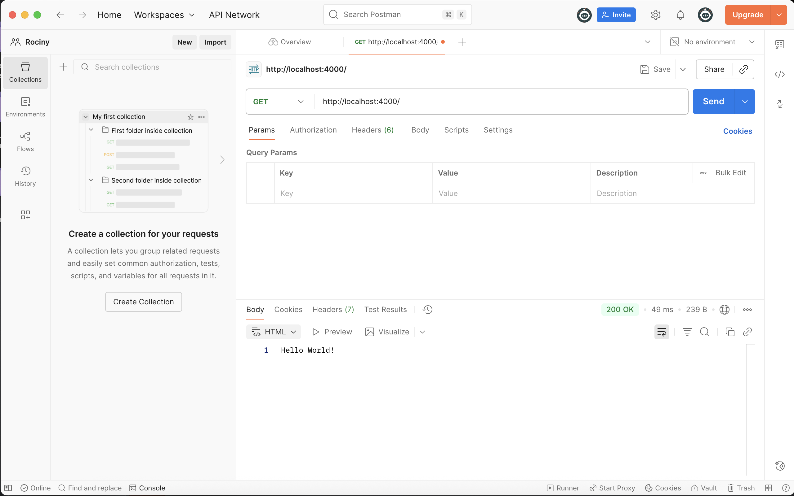

# Rociny Auth Back — Initial Setup

Rociny Auth Back est un service d’authentification basé sur le framework **NestJS**.
Ce projet servira de base pour la gestion des utilisateurs, la création de tokens JWT, et la sécurisation des endpoints d’une future application Rociny.

### Installation et Configuration

1. Cloner le projet
```bash
git clone https://github.com/HamzaNADIFI07/Rociny-Auth
cd rociny-auth/rociny-auth-back
```
2. Installer les dépendances
```bash
npm install
```
3. Lancer le serveur
```bash
npm run start
```
4. Test du fonctionnement (Facultatif)

- Après lancement du serveur, soit on ouvre le navigateur sur `http://localhost:4000/`, et on aura comme rendu **Hello World!**.

- Sinon, on utilise Postman sur l'adresse `http://localhost:4000/` avec la méthode `GET`, et on a aura comme rendu **Hello World!**.



